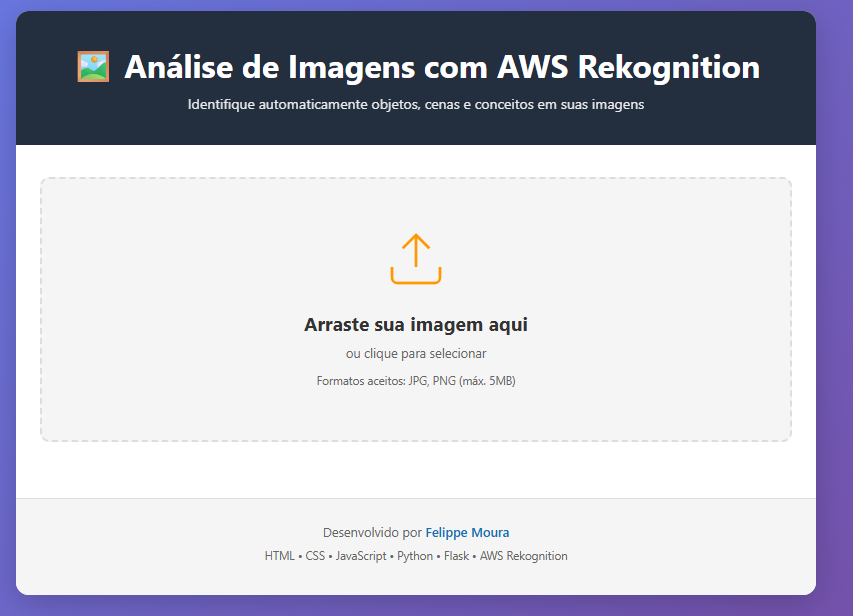
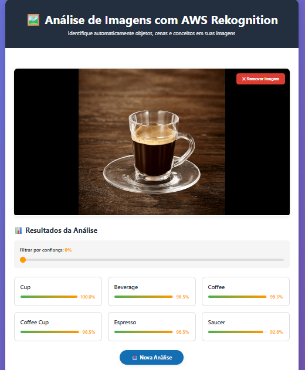

# 🖼️ Image Labels Generator - AWS Rekognition

> Aplicação web para análise automática de imagens usando AWS Rekognition

[](https://choosealicense.com/licenses/mit/)
[](https://www.python.org/)
[](https://flask.palletsprojects.com/)
[](https://aws.amazon.com/rekognition/)

## 📋 Sobre o Projeto

Este projeto demonstra a integração com o serviço AWS Rekognition para identificar automaticamente objetos, cenas e conceitos em imagens. A aplicação permite que usuários façam upload de imagens e recebam análises detalhadas com níveis de confiança ajustáveis.

**🎯 Objetivo:** Demonstrar habilidades de integração com serviços AWS, desenvolvimento full-stack e boas práticas de programação.

## ✨ Funcionalidades

- ✅ Upload de imagens via drag-and-drop ou seleção manual
- ✅ Suporte para formatos JPG e PNG (até 5MB)
- ✅ Análise automática com AWS Rekognition
- ✅ Exibição de labels com barras de confiança
- ✅ Filtro de confiança ajustável em tempo real
- ✅ Interface responsiva e moderna
- ✅ Preview da imagem antes da análise
- ✅ Tratamento de erros amigável

## 🚀 Tecnologias

### Frontend
- **HTML5** - Estrutura semântica
- **CSS3** - Estilização moderna com animações
- **JavaScript (Vanilla)** - Lógica de interface e integração com API

### Backend
- **Python 3.9+** - Linguagem principal
- **Flask** - Framework web minimalista
- **Boto3** - SDK oficial da AWS para Python
- **Flask-CORS** - Habilitação de requisições cross-origin
- **python-dotenv** - Gerenciamento de variáveis de ambiente

### Cloud
- **AWS Rekognition** - Serviço de análise de imagens
- **AWS IAM** - Gerenciamento de credenciais e permissões

## 📁 Estrutura do Projeto

```
rekognition-image-labels/
├── frontend/                 # Interface do usuário
│   ├── index.html           # Estrutura HTML
│   ├── style.css            # Estilos e animações
│   └── app.js               # Lógica JavaScript
├── backend/                 # API Flask
│   ├── app.py              # Aplicação principal Flask
│   ├── rekognition_service.py  # Integração com AWS
│   └── requirements.txt    # Dependências Python
├── .env.example            # Template de variáveis de ambiente
├── .gitignore             # Arquivos ignorados pelo Git
└── README.md              # Documentação
```

## ⚙️ Configuração

### Pré-requisitos

Antes de começar, você precisa ter instalado:

- [Python 3.9+](https://www.python.org/downloads/)
- [pip](https://pip.pypa.io/en/stable/installation/) (gerenciador de pacotes Python)
- [Git](https://git-scm.com/downloads)
- Uma conta [AWS](https://aws.amazon.com/) ativa
- [AWS CLI](https://aws.amazon.com/cli/) configurado (opcional, mas recomendado)

### 1️⃣ Clone o Repositório

```bash
git clone https://github.com/felippemcc/rekognition-image-labels.git
cd rekognition-image-labels
```

### 2️⃣ Configuração AWS

#### Criar usuário IAM

1. Acesse o [Console AWS IAM](https://console.aws.amazon.com/iam/)
2. Navegue até **Users** → **Add user**
3. Nome do usuário: `rekognition-app-user`
4. Tipo de acesso: **Programmatic access**
5. Anexe a política: **AmazonRekognitionFullAccess**
6. **Importante:** Salve as credenciais `Access Key ID` e `Secret Access Key`

#### Permissões necessárias

```json
{
    "Version": "2012-10-17",
    "Statement": [
        {
            "Effect": "Allow",
            "Action": [
                "rekognition:DetectLabels"
            ],
            "Resource": "*"
        }
    ]
}
```

### 3️⃣ Configuração do Backend

```bash
cd backend

# Criar ambiente virtual
python -m venv venv

# Ativar ambiente virtual
# Windows:
venv\Scripts\activate
# Linux/Mac:
source venv/bin/activate

# Instalar dependências
pip install -r requirements.txt
```

### 4️⃣ Variáveis de Ambiente

Crie um arquivo `.env` na pasta `backend/`:

```bash
cp .env.example .env
```

Edite o arquivo `.env` com suas credenciais:

```env
# AWS Credentials
AWS_ACCESS_KEY_ID=sua_access_key_aqui
AWS_SECRET_ACCESS_KEY=sua_secret_key_aqui
AWS_REGION=us-east-1

# Application Settings
FLASK_ENV=development
FLASK_DEBUG=True
MAX_IMAGE_SIZE=5242880
MIN_CONFIDENCE=80
```

⚠️ **IMPORTANTE:** Nunca commite o arquivo `.env` no Git!

### 5️⃣ Instalação Completa

```bash
# Backend
cd backend
pip install -r requirements.txt

# Frontend (não requer instalação, apenas um navegador)
```

## 🎯 Como Usar

### Iniciando o Backend

```bash
cd backend
python app.py
```

O servidor estará rodando em: `http://localhost:5000`

Você verá:
```
 * Running on http://0.0.0.0:5000
 * Restarting with stat
 * Debugger is active!
```

### Acessando o Frontend

**Opção 1: Abrir diretamente no navegador**
```bash
# Navegue até a pasta frontend e abra o index.html
cd frontend
# Depois abra o arquivo index.html no seu navegador
```

**Opção 2: Usar um servidor HTTP local**
```bash
cd frontend
python -m http.server 8000
```
Acesse: `http://localhost:8000`

### Usando a Aplicação

1. **Upload da Imagem:**
   - Arraste e solte uma imagem na área de upload, OU
   - Clique na área de upload para selecionar um arquivo

2. **Análise:**
   - Clique no botão **"🔍 Analisar Imagem"**
   - Aguarde o processamento (alguns segundos)

3. **Resultados:**
   - Visualize as labels detectadas com seus níveis de confiança
   - Use o slider para filtrar resultados por confiança mínima
   - Cada label mostra uma barra de progresso indicando a confiança

4. **Nova Análise:**
   - Clique em **"📤 Nova Análise"** para começar novamente

## 🧪 Testando a API

### Health Check

```bash
curl http://localhost:5000/health
```

Resposta esperada:
```json
{
    "status": "healthy",
    "service": "Image Labels Generator",
    "version": "1.0.0"
}
```

### Analisar Imagem (via curl)

```bash
# Converter imagem para base64
base64_image=$(base64 -w 0 sua_imagem.jpg)

# Fazer requisição
curl -X POST http://localhost:5000/api/analyze \
  -H "Content-Type: application/json" \
  -d "{\"image\":\"data:image/jpeg;base64,$base64_image\",\"min_confidence\":80}"
```

## 🚀 Deploy

### Frontend

#### Opção 1: Netlify
1. Faça login no [Netlify](https://www.netlify.com/)
2. Arraste a pasta `frontend/` para o dashboard
3. Pronto! Seu site está no ar

#### Opção 2: Vercel
```bash
cd frontend
npx vercel
```

#### Opção 3: GitHub Pages
1. Faça push da pasta `frontend/` para um repositório
2. Vá em Settings → Pages
3. Selecione a branch e a pasta `frontend/`

**⚠️ Lembre-se:** Atualize a URL da API no `app.js` após o deploy do backend!

### Backend

#### Opção 1: AWS EC2
```bash
# 1. Criar instância EC2
# 2. Configurar Security Group (porta 5000)
# 3. SSH na instância
ssh -i sua-chave.pem ec2-user@seu-ip

# 4. Instalar dependências
sudo yum update -y
sudo yum install python3 python3-pip -y

# 5. Clonar repositório
git clone https://github.com/felippemcc/rekognition-image-labels.git
cd rekognition-image-labels/backend

# 6. Configurar e rodar
pip3 install -r requirements.txt
python3 app.py
```

#### Opção 2: Heroku
```bash
# 1. Criar Procfile
echo "web: cd backend && python app.py" > Procfile

# 2. Deploy
heroku create seu-app-name
git push heroku main

# 3. Configurar variáveis de ambiente
heroku config:set AWS_ACCESS_KEY_ID=sua_chave
heroku config:set AWS_SECRET_ACCESS_KEY=sua_secret
```

#### Opção 3: Railway
1. Conecte seu repositório no [Railway](https://railway.app/)
2. Adicione as variáveis de ambiente
3. Deploy automático!

## 📊 Formato de Resposta da API

```json
{
    "success": true,
    "labels": [
        {
            "Name": "Coffee",
            "Confidence": 99.87654321,
            "Instances": [],
            "Parents": [
                {"Name": "Beverage"},
                {"Name": "Drink"}
            ]
        },
        {
            "Name": "Cup",
            "Confidence": 99.12345678,
            "Instances": [
                {
                    "BoundingBox": {...},
                    "Confidence": 99.12
                }
            ],
            "Parents": []
        }
    ],
    "label_count": 10,
    "timestamp": "2024-01-15T10:30:00"
}
```

## 🔒 Segurança

- ✅ Credenciais AWS armazenadas em variáveis de ambiente
- ✅ `.env` incluído no `.gitignore`
- ✅ Validação de tamanho e tipo de arquivo
- ✅ CORS configurado adequadamente
- ✅ Tratamento de erros robusto

## 🐛 Troubleshooting

### Erro: "Failed to fetch"
- ✅ Verifique se o backend está rodando (`python app.py`)
- ✅ Confirme se a URL no `app.js` está correta
- ✅ Verifique se CORS está habilitado

### Erro: "AWS Credentials not found"
- ✅ Verifique se o arquivo `.env` existe
- ✅ Confirme se as credenciais estão corretas
- ✅ Teste com `aws configure` no terminal

### Erro: "Image too large"
- ✅ A imagem deve ter no máximo 5MB
- ✅ Comprima a imagem antes do upload

### Labels não aparecem
- ✅ Ajuste o slider de confiança para 0%
- ✅ Tente com imagens diferentes e de boa qualidade

## 📈 Melhorias Futuras

- [ ] Suporte para múltiplas imagens
- [ ] Histórico de análises
- [ ] Exportar resultados em CSV/JSON
- [ ] Autenticação de usuários
- [ ] Análise de detecção de rostos
- [ ] Detecção de texto em imagens (OCR)
- [ ] Modo escuro na interface
- [ ] Comparação entre imagens
- [ ] API REST completa com documentação Swagger

## 🤝 Contribuindo

Contribuições são bem-vindas! Este é um projeto de portfólio, mas sugestões e melhorias são sempre apreciadas.

1. Fork o projeto
2. Crie uma branch para sua feature (`git checkout -b feature/AmazingFeature`)
3. Commit suas mudanças (`git commit -m 'Add some AmazingFeature'`)
4. Push para a branch (`git push origin feature/AmazingFeature`)
5. Abra um Pull Request

## 📄 Licença

Este projeto está sob a licença MIT. Veja o arquivo [LICENSE](LICENSE) para mais detalhes.

## 👤 Autor

**Felippe Moura**

- 🌐 GitHub: [@felippemcc](https://github.com/felippemcc)
- 💼 LinkedIn: [Felippe Moura](https://www.linkedin.com/in/felippemoura/)
- 📧 Email: felippe.mcc1@gmail.com

---

## 🔗 Links Úteis

- [Documentação AWS Rekognition](https://docs.aws.amazon.com/rekognition/)
- [Flask Documentation](https://flask.palletsprojects.com/)
- [Boto3 Documentation](https://boto3.amazonaws.com/v1/documentation/api/latest/index.html)
- [AWS Free Tier](https://aws.amazon.com/free/)

## 📸 Screenshots

### Interface Principal


### Resultados da Análise



---

⭐ Se este projeto foi útil para você, considere dar uma estrela no repositório!

**Desenvolvido com ❤️ e ☕ por Felippe Moura**