# 🖼️ Image Labels Generator - AWS Rekognition

<div align="center">


**Aplicação web para análise automática de imagens usando AWS Rekognition**

### 🌐 [**Ver Demo Online**](https://rekognition-img.netlify.app/) 🌐

[Demo](#-demo) • [Funcionalidades](#-funcionalidades) • [Instalação](#-instalação) • [Uso](#-como-usar) • [Deploy](#-deploy)

---

</div>

## 🌐 Demo

🎉 **Aplicação rodando online**: [https://rekognition-img.netlify.app/](https://rekognition-img.netlify.app/)

**Experimente agora mesmo!** Faça upload de uma imagem e veja a mágica da IA acontecer.

> **Nota**: O backend pode levar alguns segundos para iniciar na primeira requisição (cold start).

---

## 📖 Sobre o Projeto

Este projeto demonstra a integração com o serviço **AWS Rekognition** para identificar automaticamente objetos, cenas e conceitos em imagens. A aplicação permite que usuários façam upload de imagens e recebam análises detalhadas com níveis de confiança ajustáveis.

### 🎯 Objetivo

Demonstrar habilidades de:
- ✅ Integração com serviços AWS
- ✅ Desenvolvimento Full-Stack (Python + JavaScript)
- ✅ APIs RESTful
- ✅ Boas práticas de programação
- ✅ Deploy de aplicações web

---

## ✨ Funcionalidades

- 📤 **Upload de imagens** via drag-and-drop ou seleção manual
- 🖼️ **Suporte para JPG e PNG** (até 5MB)
- 🤖 **Análise automática** com AWS Rekognition
- 📊 **Visualização de labels** com barras de confiança
- 🎚️ **Filtro de confiança ajustável** em tempo real
- 📱 **Interface responsiva** e moderna
- 👁️ **Preview da imagem** antes da análise
- ⚠️ **Tratamento de erros** amigável
- 🚀 **Performance otimizada**

---

## 🛠️ Tecnologias

### Frontend
| Tecnologia | Descrição |
|------------|-----------|
| **HTML5** | Estrutura semântica |
| **CSS3** | Estilização moderna com animações |
| **JavaScript** | Lógica de interface e integração |

### Backend
| Tecnologia | Versão | Descrição |
|------------|--------|-----------|
| **Python** | 3.9+ | Linguagem principal |
| **Flask** | 3.0 | Framework web minimalista |
| **Boto3** | Latest | SDK oficial da AWS |
| **Flask-CORS** | Latest | CORS para requisições cross-origin |
| **python-dotenv** | Latest | Gerenciamento de variáveis de ambiente |

### Cloud
| Serviço | Descrição |
|---------|-----------|
| **AWS Rekognition** | Análise de imagens com IA |
| **AWS IAM** | Gerenciamento de credenciais |

---

## 📁 Estrutura do Projeto

```
rekognition-image-labels/
├── frontend/                  # Interface do usuário
│   ├── index.html            # Estrutura HTML
│   ├── style.css             # Estilos e animações
│   └── app.js                # Lógica JavaScript
├── backend/                   # API Flask
│   ├── app.py                # Aplicação principal
│   ├── rekognition_service.py # Integração AWS
│   └── requirements.txt       # Dependências Python
├── .env.example              # Template de variáveis
├── .gitignore                # Arquivos ignorados
├── LICENSE                   # Licença MIT
└── README.md                 # Documentação
```

---

## 🏗️ Diagrama de Arquitetura

```mermaid
graph TB
    subgraph "Cliente"
        User[👤 Usuário]
    end

    subgraph "Frontend - Netlify"
        WebApp[🌐 Web Application<br/>HTML + CSS + JS]
    end

    subgraph "Backend - Railway"
        Flask[⚙️ Flask API<br/>Python]
        Boto3[📦 Boto3 SDK]
    end

    subgraph "AWS Cloud"
        IAM[🔐 IAM<br/>Credenciais]
        Rekognition[🤖 AWS Rekognition<br/>Análise de Imagens]
    end

    User -->|1. Acessa| WebApp
    User -->|2. Upload Imagem| WebApp
    WebApp -->|3. POST /api/analyze<br/>Base64 Image| Flask
    Flask -->|4. Autentica| IAM
    Flask -->|5. detect_labels| Boto3
    Boto3 -->|6. API Call| Rekognition
    Rekognition -->|7. Labels + Confidence| Boto3
    Boto3 -->|8. Response| Flask
    Flask -->|9. JSON Response| WebApp
    WebApp -->|10. Exibe Resultados| User

    style User fill:#4A90E2
    style WebApp fill:#FF9900
    style Flask fill:#232F3E
    style Rekognition fill:#FF9900
    style IAM fill:#DD344C
```

---


## 🚀 Instalação

### Pré-requisitos

Antes de começar, certifique-se de ter:

- ✅ [Python 3.9+](https://www.python.org/downloads/)
- ✅ [pip](https://pip.pypa.io/en/stable/installation/) (gerenciador de pacotes)
- ✅ [Git](https://git-scm.com/downloads)
- ✅ Conta [AWS](https://aws.amazon.com/) ativa
- ✅ [AWS CLI](https://aws.amazon.com/cli/) (opcional)

### 1️⃣ Clone o Repositório

```bash
git clone https://github.com/felippemcc/rekognition-image-labels.git
cd rekognition-image-labels
```

### 2️⃣ Configure as Credenciais AWS

#### Criar Usuário IAM

1. Acesse o [Console AWS IAM](https://console.aws.amazon.com/iam/)
2. Navegue até **Users** → **Add user**
3. Nome do usuário: `rekognition-app-user`
4. Tipo de acesso: **Programmatic access**
5. Anexe a política: **AmazonRekognitionFullAccess**
6. **Importante**: Salve as credenciais:
   - `Access Key ID`
   - `Secret Access Key`

#### Política Personalizada (Opcional - Mais Seguro)

Para seguir o princípio de menor privilégio:

```json
{
  "Version": "2012-10-17",
  "Statement": [
    {
      "Effect": "Allow",
      "Action": [
        "rekognition:DetectLabels"
      ],
      "Resource": "*"
    }
  ]
}
```

### 3️⃣ Instalar Dependências do Backend

```bash
cd backend

# Criar ambiente virtual
python -m venv venv

# Ativar ambiente virtual
# Windows:
venv\Scripts\activate
# Linux/Mac:
source venv/bin/activate

# Instalar dependências
pip install -r requirements.txt
```

### 4️⃣ Configurar Variáveis de Ambiente

Crie um arquivo `.env` na pasta `backend/`:

```bash
cp .env.example .env
```

Edite o arquivo `.env`:

```env
# AWS Credentials
AWS_ACCESS_KEY_ID=sua_access_key_aqui
AWS_SECRET_ACCESS_KEY=sua_secret_key_aqui
AWS_REGION=us-east-1

# Application Settings
FLASK_ENV=development
FLASK_DEBUG=True
MAX_IMAGE_SIZE=5242880
MIN_CONFIDENCE=80
```

⚠️ **IMPORTANTE**: Nunca commite o arquivo `.env` no Git!

---

## ▶️ Como Rodar

### Backend (API Flask)

```bash
cd backend
python app.py
```

O servidor estará rodando em: **http://localhost:5000**

Você verá:
```
 * Running on http://0.0.0.0:5000
 * Restarting with stat
 * Debugger is active!
```

### Frontend

**Opção 1**: Abrir diretamente no navegador
```bash
cd frontend
# Abra o arquivo index.html no seu navegador
```

**Opção 2**: Servidor HTTP local
```bash
cd frontend
python -m http.server 8000
```
Acesse: **http://localhost:8000**

---

## 🎮 Como Usar

1. **Upload da Imagem**
   - Arraste e solte uma imagem na área de upload, OU
   - Clique na área de upload para selecionar um arquivo

2. **Análise**
   - Clique no botão **"🔍 Analisar Imagem"**
   - Aguarde o processamento (alguns segundos)

3. **Resultados**
   - Visualize as labels detectadas com seus níveis de confiança
   - Use o slider para filtrar resultados por confiança mínima
   - Cada label mostra uma barra de progresso indicando a confiança

4. **Nova Análise**
   - Clique em **"📤 Nova Análise"** para começar novamente

---

## 🧪 Testes

### Health Check

```bash
curl http://localhost:5000/health
```

Resposta esperada:
```json
{
  "status": "healthy",
  "service": "Image Labels Generator",
  "version": "1.0.0"
}
```

### Testar Análise de Imagem

```bash
# Converter imagem para base64
base64_image=$(base64 -w 0 sua_imagem.jpg)

# Fazer requisição
curl -X POST http://localhost:5000/api/analyze \
  -H "Content-Type: application/json" \
  -d "{\"image\":\"data:image/jpeg;base64,$base64_image\",\"min_confidence\":80}"
```

---

## 🌐 Deploy

### Frontend

#### Netlify
1. Faça login no [Netlify](https://www.netlify.com/)
2. Arraste a pasta `frontend/` para o dashboard
3. Pronto! Seu site está no ar

#### Vercel
```bash
cd frontend
npx vercel
```

#### GitHub Pages
1. Faça push da pasta `frontend/` para um repositório
2. Vá em **Settings** → **Pages**
3. Selecione a branch e a pasta `frontend/`

⚠️ **Lembre-se**: Atualize a URL da API no `app.js` após o deploy do backend!

### Backend

#### Railway (Recomendado - Mais Fácil)
1. Conecte seu repositório no [Railway](https://railway.app/)
2. Adicione as variáveis de ambiente
3. Deploy automático!

#### Render
1. Crie uma conta no [Render](https://render.com/)
2. Conecte seu repositório GitHub
3. Configure as variáveis de ambiente
4. Deploy!

#### AWS EC2 (Produção)
```bash
# 1. Criar instância EC2
# 2. Configurar Security Group (porta 5000)
# 3. SSH na instância
ssh -i sua-chave.pem ec2-user@seu-ip

# 4. Instalar dependências
sudo yum update -y
sudo yum install python3 python3-pip -y

# 5. Clonar repositório
git clone https://github.com/felippemcc/rekognition-image-labels.git
cd rekognition-image-labels/backend

# 6. Configurar e rodar
pip3 install -r requirements.txt
python3 app.py
```

---

## 📊 Exemplo de Resposta da API

```json
{
  "success": true,
  "labels": [
    {
      "name": "Coffee",
      "confidence": 99.88,
      "parents": ["Beverage", "Drink"]
    },
    {
      "name": "Cup",
      "confidence": 99.12,
      "parents": []
    }
  ],
  "label_count": 10
}
```

---

## 🔒 Segurança

- ✅ Credenciais AWS armazenadas em variáveis de ambiente
- ✅ `.env` incluído no `.gitignore`
- ✅ Validação de tamanho e tipo de arquivo
- ✅ CORS configurado adequadamente
- ✅ Tratamento de erros robusto
- ✅ Política IAM com menor privilégio possível

---

## 🐛 Troubleshooting

### Backend não está respondendo
- ✅ Verifique se o backend está rodando (`python app.py`)
- ✅ Confirme se a URL no `app.js` está correta
- ✅ Verifique se CORS está habilitado

### Erro de credenciais AWS
- ✅ Verifique se o arquivo `.env` existe
- ✅ Confirme se as credenciais estão corretas
- ✅ Teste com `aws configure` no terminal

### Imagem muito grande
- ✅ A imagem deve ter no máximo 5MB
- ✅ Comprima a imagem antes do upload

### Nenhum resultado aparece
- ✅ Ajuste o slider de confiança para 0%
- ✅ Tente com imagens diferentes e de boa qualidade

---

## 🎯 Roadmap

Funcionalidades planejadas:

- [ ] Suporte para múltiplas imagens
- [ ] Histórico de análises
- [ ] Exportar resultados em CSV/JSON
- [ ] Autenticação de usuários
- [ ] Análise de detecção de rostos
- [ ] Detecção de texto em imagens (OCR)
- [ ] Modo escuro na interface
- [ ] Comparação entre imagens
- [ ] Documentação Swagger da API

---

## 🤝 Contribuindo

Contribuições são bem-vindas! Este é um projeto de portfólio, mas sugestões e melhorias são sempre apreciadas.

1. Fork o projeto
2. Crie uma branch para sua feature (`git checkout -b feature/AmazingFeature`)
3. Commit suas mudanças (`git commit -m 'Add some AmazingFeature'`)
4. Push para a branch (`git push origin feature/AmazingFeature`)
5. Abra um Pull Request

---

## 📄 Licença

Este projeto está sob a licença MIT. Veja o arquivo [LICENSE](LICENSE) para mais detalhes.

---

## 👤 Autor

**Felippe Moura**

- 🌐 GitHub: [@felippemcc](https://github.com/felippemcc)
- 💼 LinkedIn: [Felippe Moura](https://www.linkedin.com/in/felippemoura/)
- 📧 Email: felippe.mcc1@gmail.com

---

## 📚 Recursos Úteis

- [AWS Rekognition Documentation](https://docs.aws.amazon.com/rekognition/)
- [Flask Documentation](https://flask.palletsprojects.com/)
- [Boto3 Documentation](https://boto3.amazonaws.com/v1/documentation/api/latest/index.html)
- [AWS Free Tier](https://aws.amazon.com/free/)

---

<div align="center">

### ⭐ Se este projeto foi útil para você, considere dar uma estrela!

**Desenvolvido com ❤️ e ☕ por [Felippe Moura](https://github.com/felippemcc)**

</div>